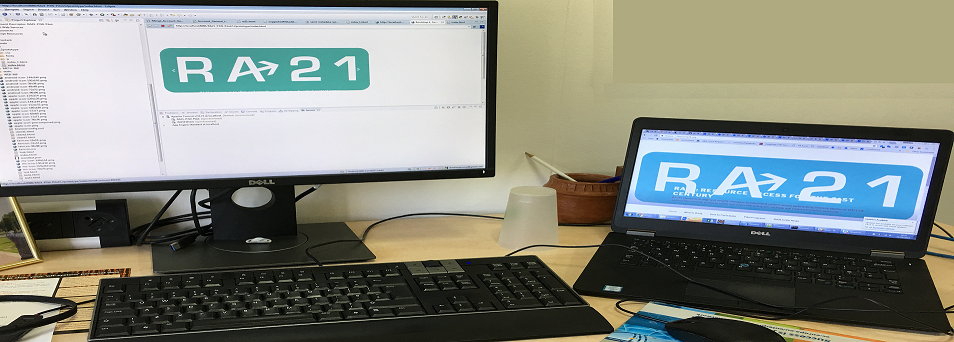

# RA21 Prototype zone

### This project is for a prototyping and demonstrating some of the functionality discussed in the [RA21 initiative](https://ra21.org/) with the goal to improve some of the fundamental issues around federated identity and institutional discovery. (Visit the [RA21 site](https://ra21.org/) for additional information).

### Content of the project
Level 2 prototype
- This prototype implements the insertion of a CTA button in an iframe, showing either the last institution selected via a discovery service and stored in localstorage or a 'Check Access' feature allowing to look for your institution via the discovery service.
(TODO - more coming soon)
